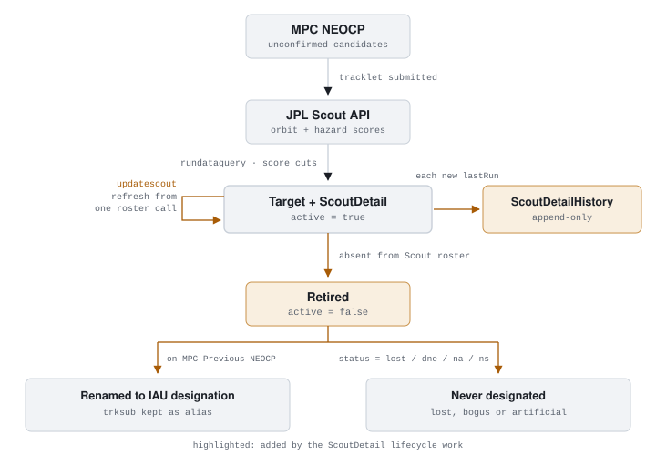
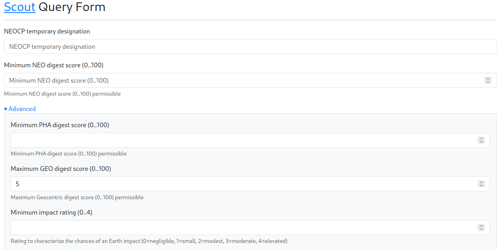
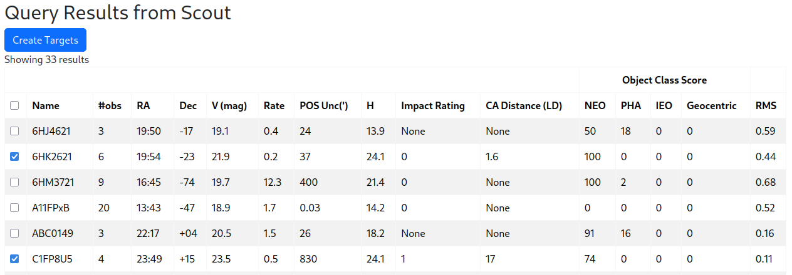

# JPL TOM Dataservice Module

This module adds JPL [Scout](https://cneos.jpl.nasa.gov/scout/intro.html) support to the TOM
Toolkit. Using this module TOMs can query Scout NEO Candidate data.

`tom_jpl` provides the following features to the TOM Toolkit:

1. A way to query the JPL Scout service (by providing a TOM Toolkit `DataService` called `ScoutDataService`) for all current targets or a specific target. The service and associated form allows optionally applying cuts/filters on the parameters, which is not supported in the Scout API. For single object queries, this also retrieves the orbital elements, allowing non-sidereal `Target` creation.

2. Mechanisms to store state and history: the Scout service provides no means to access past computations or previous versions of the target when it is updated with additional observations. `tom_jpl` provides a `ScoutDetail` model to store Scout-specific quantities that don't fit into `Target`, `ScoutDetailHistory` to track changes in parameters values and a target-detail tab and admin tools to view this.

## Installation

Install the module into your TOM environment:

    pip install tom-jpl

Include the app in your `INSTALLED_APPS` in your TOM's `settings.py`:

    INSTALLED_APPS = [
        ...
        'tom_jpl',
    ]

## Usage

The workflow is illustrated in the figure below:

<picture>
  <source media="(prefers-color-scheme: dark)" srcset="docs/images/scout-lifecycle-dark.svg">
  
</picture>

Normal use consists of:

1. Using the Scout Query Form to define desired cuts (and optionally saving the query for later re-use). Navigate to **Data Services** → **Scout** in the top navbar of your TOM to bring up the form:
   <picture>
     
   </picture>
   and then hitting the **Run** button (tick the **Save Query** to save the current set of parameters for later re-use e.g. 3. below)

2. This will result in a Query Results table being displayed:
   <picture>
     
   </picture>
   Targets which have been ticked in the left-most column will have `Target`s created when the **Create Targets** button is pressed.

3. **Using the built and saved query from above to keep things up to date.** Saved queries are listed under **Data Services** → **Saved Queries**, or can be retrieved and viewed from the command line:

   ```
   python manage.py listqueries
   ```

   Then ingest the matching candidates and keep them up to date:

   ```
   python manage.py rundataquery <query_id>
   python manage.py updatescout
   ```

   The two `updatescout` phases have different natural cadences: reconciliation tracks the
   Scout roster, which changes hourly, while the MPC's Previous-NEOCP outcome page holds
   months of departures, so a daily check is plenty (and is kinder to the MPC's servers).
   From `cron`, run them as two entries:

   ```
   17 * * * *  python manage.py updatescout --skip-designations
   47 4 * * *  python manage.py updatescout --skip-reconcile
   ```

   Note: `rundataquery` catches its own failures and logs them rather than raising, so a failed run exits 0 and prints 'Finished querying targets' only on success. This should be borne in mind if running from e.g. a `cron` job, in that silent failures won't trip a non-zero exit check.
